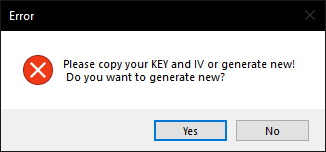
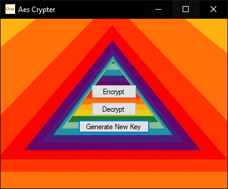

# CSharpAesFileCrypter

A gui for encrypting files with Aes-256 encryption.
There should be no max size limit for file, since the encryption is based on streams.

You may encounter an error at startup. The program saves the key in the folder where the program is stored. If you click yes to the box it will generate new key and iv. You only need to do this once.

## License
MIT
